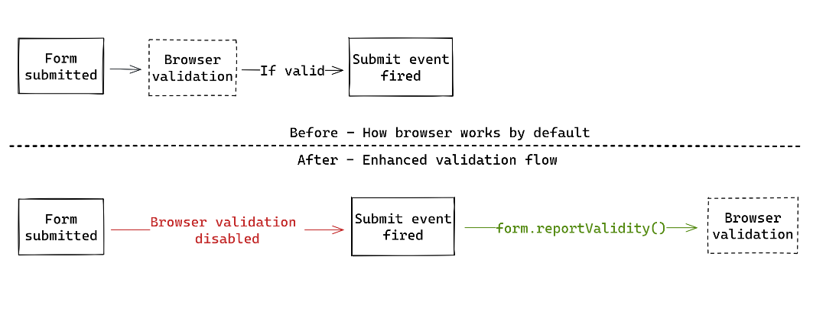
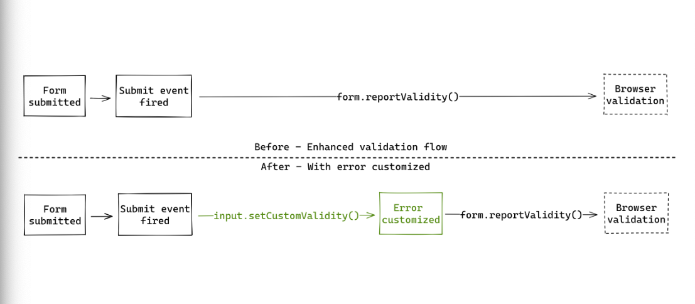
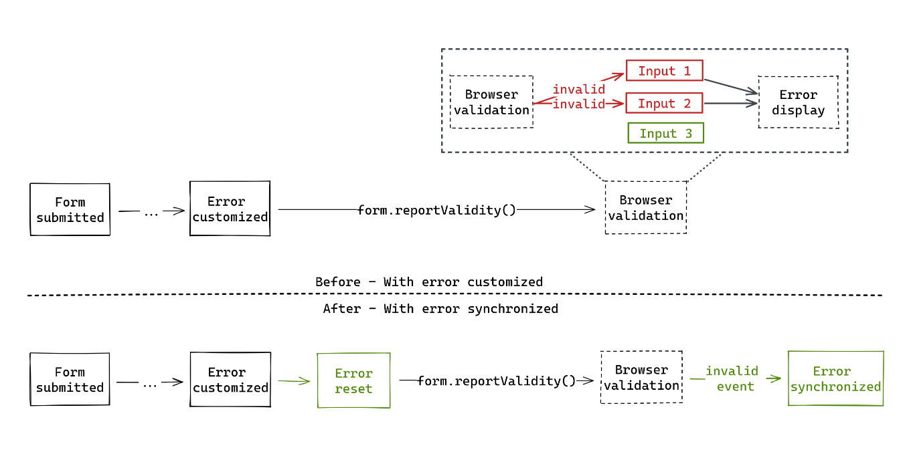

# Form validation



## Browser mechanism for form validation

- `Constraint validation` was introduced in HTML5.
- Constraints like `required`, `type=email` etc. helps browser in validation.
- Browser blocks the form submission and informs user if validation fails.

## Customization the form validation (Conform)

- First we disable the default form validation so that we can add custom logic.
- Then we customize the error messages.

## Error interface

- `validationMessage`: Property to get the validation message.
- `setCustomValidity()`: Method to set the validation message.

```javascript
const [input] = document.getElementsByTagName('input');
​
// Check message displayed
console.log(input.validationMessage);
​
// Override message
input.setCustomValidity('This is invalid');
​
// See updated message
console.log(input.validationMessage);
```

- `validity`: Property representing the valid state of the input.

```javascript
{
  "badInput": false,
  "customError": false,
  "patternMismatch": false, // pattern
  "rangeOverflow": false, // max
  "rangeUnderflow": false, // min
  "stepMismatch": false, // step
  "tooLong": false, // maxlength
  "tooShort": false, // minlength
  "typeMismatch": false, // type
  "valid": true,
  "valueMissing": false // required
}
```

## New validation flow with error customized



## Validation flow with error synchronized

- When browser validation happens, an invalid event if fired for each invalid input and trigger the error display.
- We can't check when an invalid input becomes valid again.
- To get around this we reset the error state before synchronizing the errors.



## Introducing @conform-to/validitystate

- Provides server validation.
- Provides a ValidityState like interface based on the validation attributes.
- Supports type inference and coercions
- 0 kb on the client.
